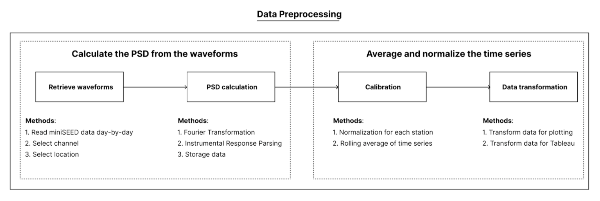
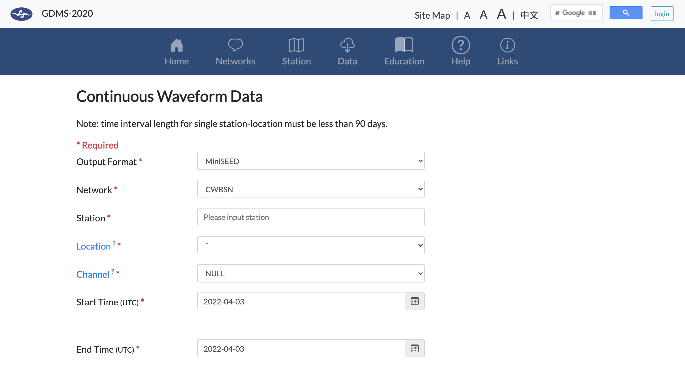

# PSD lockdown

Power spectral density (PSD) is a common methodology to measure the energy of waves. This project focuses on the calculation of PSD of seismic waves in order to measure the impact of culture noise during the COVID-19 pandemic according to "*Global quieting of high-frequency seismic noise due to COVID-19 pandemic lockdown measures*" from Lecocq et al. (2020). 

Inputs to the project includes daily miniseed waveform file, instrument response file, station list, and duration of the project, which can be downloaded easily via various sites. In this project, GDMS database from the Central Weather Bureau (CWB) was used to measure the impact of soft lockdown measures starting from the mid-May.

The outputs include a CSV file including all PSD values and a daily average along with the corresponding `matplotlib` datetime values and a PNG file plottet using matplotlib.pyplot.


# Setup

To clone the repository:
```sh
git clone https://github.com/enjuichang/PSD-lockdown.git
```

After cloning the repository, there are some CSV files that contains calculated PSD of each station to work with if your interest is in visualization. If the goal is understand the complete data pipeline, please follow the next steps.

## Data pipeline overview



The figure above shows the data pipeline that contained in this repository. The goal of the repository is to use Python tools to process the seismic waveforms into useful information for the utilization of subsequent data visualization tools (e.g., Tableau). However, there is one additional step required that is not included in this image -- the retrieval of the ms_DATA files. Please follow the next section to obtain the files.

## Retrieve Raw Files

Here is the list of raw files that is required to execute seismic noise analysis:

1. **miniSEED**:MiniSEED files contain the time series of the seismic waveform which is then used to calculate the PSD and further analysis.

2. **RESP**: RESP files contain the instrument responses that are used to adjust the waveforms that are highly susceptible to instrumental bias.

The easiest way to collect this information is through [Taiwan Geophysical Database Management System (GDMS)](https://gdmsn.cwb.gov.tw/index.php) website form the Central Weather Bureau of Taiwan. The following steps are required to download the miniSEED files listed above:

1. **Login/Sign up**: Please log into the GDMS website to access raw files.
2. **Select Data**: After logging in, go to the "*Data*" tab and choose "*Continous Waveform Data*". You should see the following page once you successfully entered the correct system.



3. **Select Configuration**: This interface shows the data format available, select the appropriate data and submit.
    - *Output format*: Select miniSEED. Sometimes SEED files are available, but SEED files contains additional meta information of the data that is unnecessary in this application.
    - *Network*: Select CWBSN. Please find the network of the seismic stations associated with your station of interest.
    - *Station*: Input the station name
    - *Location*: Select 00 or 10. If the station has seismometers at different depths, it is possible to select different seismometers individually.
    - *Channel*: Select HHZ. Select the appropriate channel of interest on the seismometers.
    - *Start Time/End Time*: Select the appropriate start and end time of the data.
    - *Label*: Please enter Station_startYearMonthDay_endYearMonthDay (e.g., BAC_20200601_20200605) for easier processing in the later procedure.

4. **Submit**: Submit the form and wait for the file.

For the instrument response files, please follow these steps below:

1. **Login/Sign up**: Please log into the GDMS website to access raw files.
2. **Select Data**: After logging in, go to the "*Data*" tab and choose "*Intrument Response*". You should see a similar interface as the miniSEED but with different fields.

3. **Select Configuration**: This interface shows the data format available, select the appropriate data and submit.
    - *Output format*: Select RESP file.
    - *Network*: Select CWBSN. Please find the network of the seismic stations associated with your station of interest.
    - *Station*: Input the station name
    - *Location*: Select 00 or 10. If the station has seismometers at different depths, it is possible to select different seismometers individually.
    - *Channel*: Select HHZ. Select the appropriate channel of interest on the seismometers.
    - *Start Time/End Time*: Select the appropriate start and end time of the data.
    - *Label*: No need to input.

4. **Submit**: Submit the form and wait for the file.

Now you have successfully retrieved the seismic waveform data from an open source database.

### One last step

One additional step is needed before inputting the miniSEED data into the files. As ObsPy package cannot handle data larger than 1 month, the unit for of our miniSEED files are "1 day". Therefore, it is necessary to run '`cut_ms.py`' in the `src` folder with your miniSEED file as an input. Here is a simple way to do it using command line tools:

```sh
python3 ./src/cut_ms.py [miniSEED Filename (e.g., BAC_20200601_20200605.miniSEED)]
```

This should automatically generate the appropriate files in the `ms_DATA` folder as the format of Network_Station_YearMonthDay.ms (e.g., CWB24_HSN_20210401.ms), which is required for running the all other code.


# Structure

```
│
├── README.md          <- The top-level README for developers using this project
├── Readme_figs        <- Figures in the README files
│
├── EVTLST             <- Event list files that contain the all dates of interests.
│
├── STALST             <- Station list files that contain the all stations of interests.
│
├── ms_DATA            <- Preprocessed miniSEED files that contain 1 day of waveform each
│
├── CSV                <- All generated CSV files including PSD values and transformed data for Tableau
│
├── PNG                <- Generate visualization from the repository
│
├── RESP               <- Instrument response files for each station
│
├── SCRIPT             <- Serialized shell scripts that were used for remoting computing
│   ├── M00_run.sh              <- Run the data pipeline from retrieval to visualization
│   ├── M01_Calculate_psd.sh    <- Run only the calculation of PSD from miniSEED files
│   ├── M02_Calculate_avg.sh    <- Run only the averaging of PSD from PSD CSVs
│   ├── PRE_...                 <- Additional pre-processing scripts from generating events or RESPs
│   └── POST_...                <- Additional post-processing visualization scripts from CSVs
│
├── src                <- Python codes for calculating the PSD, generating visualization, and inference
│   ├── Calculate_PSD.py        <- Calulate the PSD from miniSEED files
│   ├── cut_ms.py               <- Cut downloaded miniSEED files to appropriate date format
│   ├── discontinuity.py        <- Run discontinuity analysis on CSVs
│   ├── draw_avg.py             <- Calculate the rolling averages for raw PSD values
│   ├── heatmap.py              <- Generate heatmaps from selected stations
│   ├── merge_csv_tableau.py    <- Transform data to format suitable for Tableau
│   ├── mobility_corr.py        <- Preprocess the Apple/Google mobility index and find correlations
│   └── multi_station.py        <- Generate line graphs with multiple stations
│
└─── requirements.txt  <- The requirements file for reproducing the analysis environment.

```